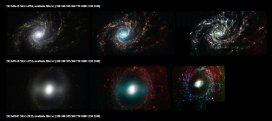
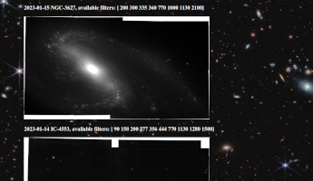
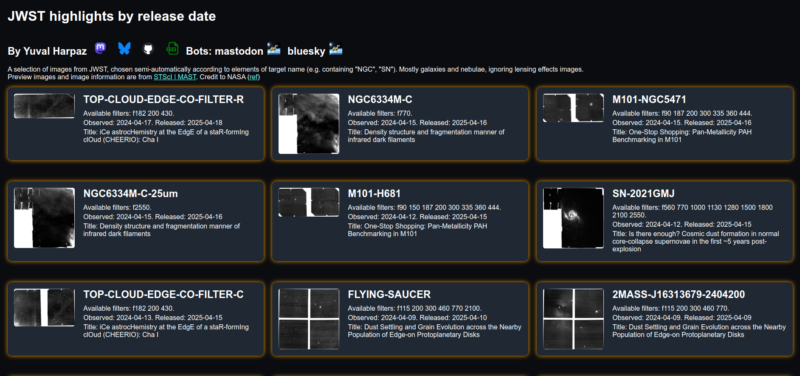
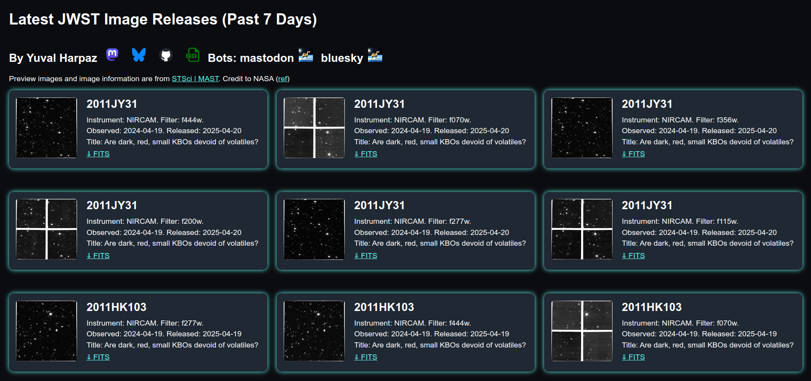
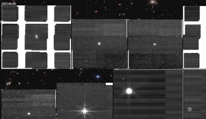
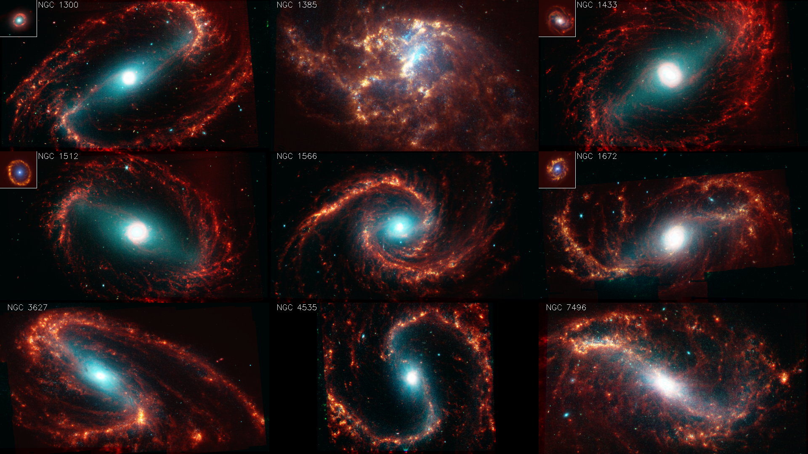

# astro  
Imaging astronomy data from JWST. Python code to download and do some post-processing for *.fits files, coming from James Webb Space Telescope (JWST) via [mast](https://mast.stsci.edu/portal/Mashup/Clients/Mast/Portal.html).
## NGC color preview images
NGC objects cover many galaxies and nebula, so here it just means interesting stuff. I allowed some objects that are not in the NGC catalogue to slip in. 
Images here were automatically created from the data. They are saved with low resolution, and meant to allow us to see what data has been collected. For high resolution images I still need to overcome coregistration issues, and fill holes. With code. 

## NGC images by release date
This is a news page, updated every 2 hours, showing example images from the latest release (I took the highest wavelength filter). You can get notified for new releases by following my 
mastodon bot [@astrobot_jwst@botsin.space](https://botsin.space/@astrobot_jwst). I arranged the images in a "stream" and in a more dense "grid" layout.   

## Level 3 images from the last 7 days
This is also a news page, showing level 3 releases. This is split to science and calibration images in seperate web pages. My [bot](https://botsin.space/@astrobot_jwst)
 updates them every two hours but only notifies wheen there are new science images. For level 2 images see [JWST Feed](https://jwstfeed.com/Home/ApplyChoice?choiceID=3) 

## Galleries
See a [gallery](https://github.com/yuval-harpaz/astro/blob/main/GALLERY.md) with some work, or a [wallpaper gallery](https://github.com/yuval-harpaz/astro/blob/main/pics/wallpaper/wallpapers.md) with images cropped to fit a standard 16:9 computer screen  

Some examples below:
### Cartwheel Galaxy
get_cartwheel.py 
cartwheel_long.py

### NGC 628
manifest = download_fits('ngc 628', include=['_miri_', '_nircam_', 'clear']) 
ngc629.py
#### NIRCam

#### MIRI

### installation
I followed the instructions recommended [here](https://github.com/spacetelescope/jdat_notebooks) or [here](https://spacetelescope.github.io/jdat_notebooks/install.html#install) but froze my requirements.txt just in case. Basically you need anaconda3 and astropy. I work with pycharm and matplotlib so no notebooks here.

