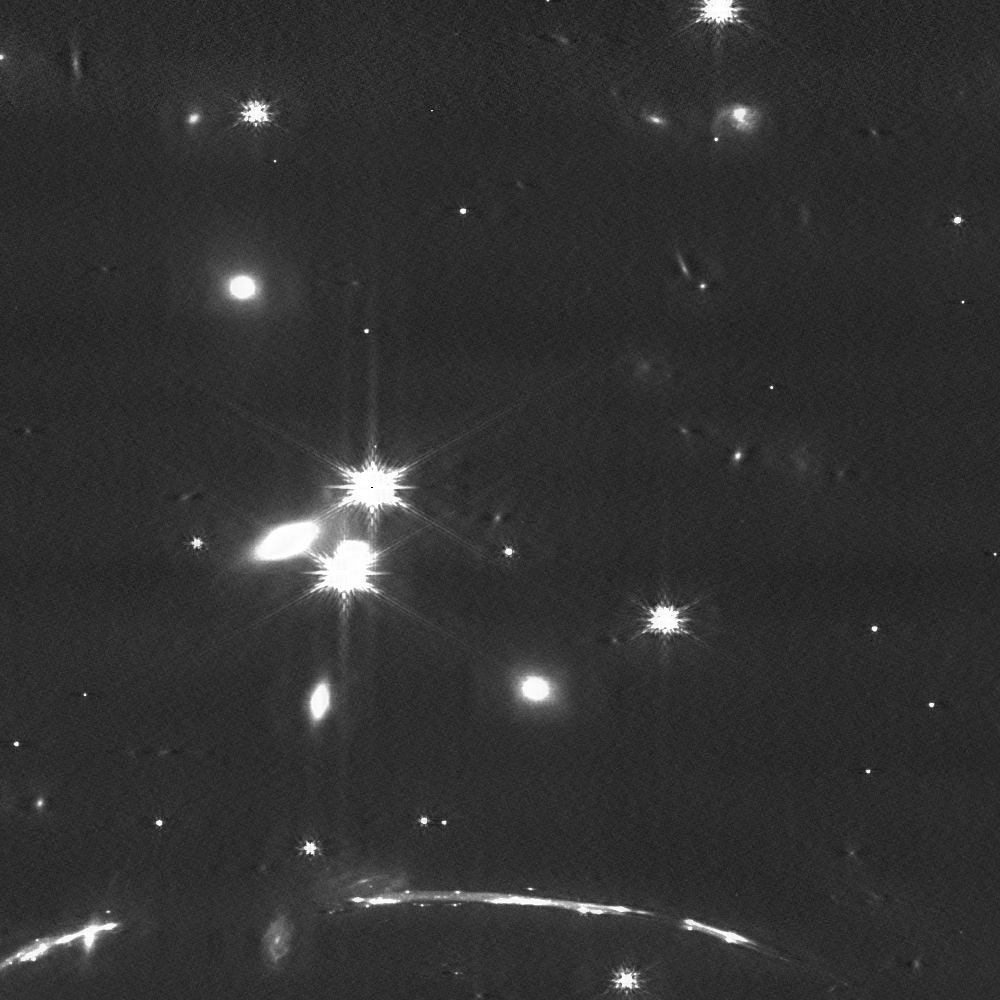
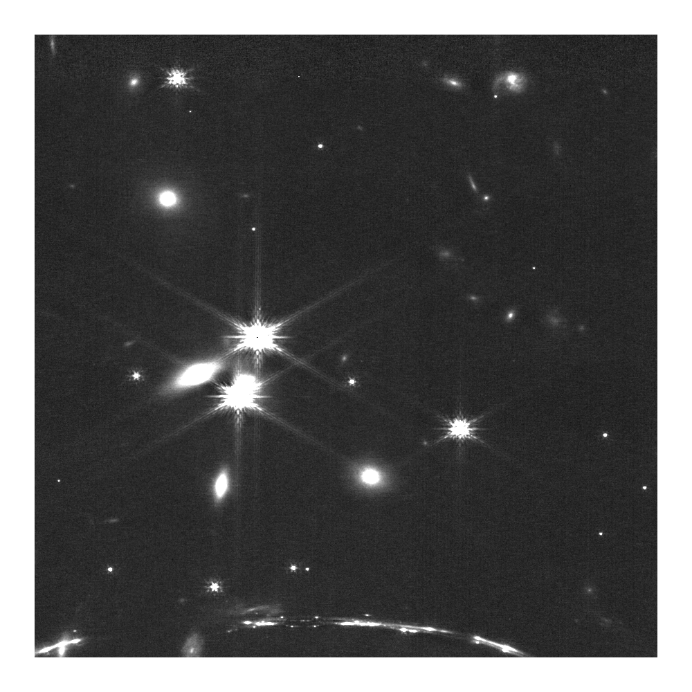
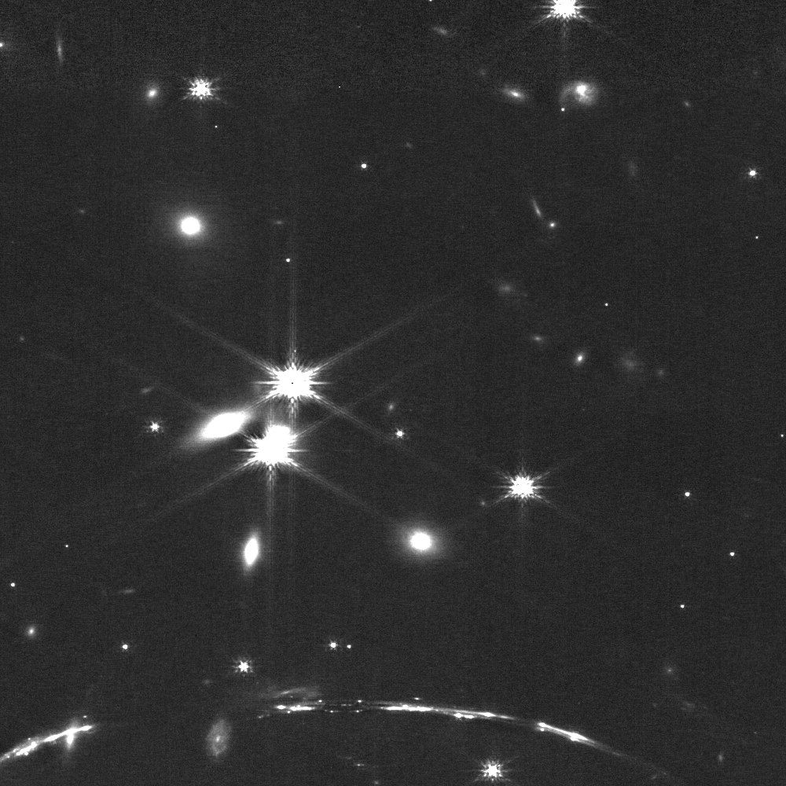

## Explaining astro_deband function for removing banding (1/f noise) from JWST data
Download the example data of sunburst arc, file jw02555-o003_t009_nircam_clear-f115w_i2d.fits, from [MAST](https://mast.stsci.edu/portal/Download/file/JWST/product/jw02555-o003_t009_nircam_clear-f115w_i2d.fits) or via [jwstfeed](https://jwstfeed.com/StsciImage/ViewImage?fullImagePath=https://mast.stsci.edu/portal/Download/file/JWST/product/jw02555-o003_t009_nircam_clear-f115w_i2d.jpg)<br>
### Banding noise
Banding noise is a pattern of thin horizontal lines visible in JWST NIRCam data, frequently for narrowband filters.
```python

import matplotlib
matplotlib.use('Qt5Agg')
from matplotlib import pyplot as plt
from astropy.io import fits
import numpy as np

hdu0 = fits.open('jw02555-o003_t009_nircam_clear-f115w_i2d.fits')
data = hdu0[1].data[3400:4400, 2900:3900]
hdu0.close()
data[data > 1] = 1
plt.imsave('raw.png', data, origin='lower', cmap='gray')
```

### G'Mic
A tool sometimes used to clean the artifact, is [G'MIC](https://gmic.eu/).
It can be used by a GUi but there is also a command line implementation. There is also a python version but it did not work for me. 
```python
import os
command = 'gmic raw.png -banding_denoise_v2 "10","0","10","20","1","0","0","50,50" -o gmic.png'
os.system(command)
```
A few issues:
* G'MIC doesn't care for direction, and cleans also vertical lines.
* There are dark pixels left and right of some stars, a result of overshoot, cleaning too much by removing real signal mistaken to be noise.
* gmic operates on an image file such as png, and not on the original .fits file data. Normally image files are created after some color stretching. Here I only removed everything above 1 (see `data[data > 1] = 1` above), but we want to keep the data for stretching after we clean it.
The process is fast, took 2.7 sec for this 1000 x 1000 pix square. One may want to play with the parameters for better cleaning. the "1" argument refers to the first choice of tile size, 64pix. You can try other sizes. 

# deband_layer, median subtraction
```python
from astro_deband import deband_layer
# read the data from fits, skip the data[data > 1] = 1 line
clean = deband_layer(data)
plt.imsave('median.png', clean, origin='lower', cmap='gray')
```
I wrote deband layer with the aim of removing the median of a selected window ( lets use the default length of 101 pixels) row by row. So for every point int he image, the median is computed using 50 pixels left and right. However, we want to keep the values if they are not particulat to the horizontal direction. I do this by creating a smoothed image combining the median filter for both orientations. In other words, I remove the fine lines while keeping the lower frequencies not specific to the horizontal direction.
* The process too 4.2sec, slower than gmic
* the overshooting is worse, large dark patches when two bright sources are horizontally aligned.
* The edges were lost, half a window for each direction (50pix)

# percentile
Subtracting the 10th percentile instead of the median improves the overshoot issue.
```python
clean = deband_layer(data, func=np.percentile, prct=10)
plt.imsave('percentile.png', clean, origin='lower', cmap='gray')
```
* overshoot (dark patches between stars) is better but not completely solved.
* we still lose half a window on all sides
* cleaning took longer, 5.6sec
* There is still a problem with the arc at the bottom of the image. The signal itself is a narrow horizontal line, and is subtracted from the image.

# nanpercentile
When the data includes nans nanpercentile must be used to avoid 101px size holes around every nan pixel. However it is also helpful for not losing the half-window strips at the margins.
```python
clean = deband_layer(data, func=np.nanpercentile, prct=10)
plt.imsave('nanpercentile.png', clean, origin='lower', cmap='gray')
```
* We still have distorted arc
* The process was 34 times slower. it took 190.1sec, big differance.

# Larger window size
To solve the distortion of the arc, we need a window long enough to include 10% baseline, dark sky. Here I used `win=401`. 
```python
clean = deband_layer(data, func=np.nanpercentile, prct=10, win=401)
plt.imsave('nanpercentile_win=401.png', clean, origin='lower', cmap='gray')
```
The arc is preserved, and areas between stars have negligible darkening, if any.
* The window might be too long to adapt for changes in noise levels along the horizontal lines 
* it took 179.7sec.

