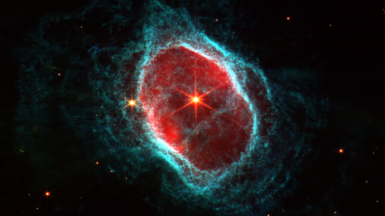
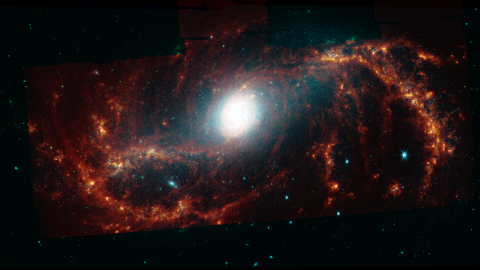

<meta property="og:image" content="https://github.com/yuval-harpaz/astro/raw/main/pics/wallpaper/thumb/southern_ring.png" />

# JWST wallpapers
### James Webb Space Telescope images prepared for 1920 x 1080 screens
Image processing and python code by [@yuvharpaz](https://twitter.com/yuvharpaz). This page and python code for download and image processing are hosted on  [GitHub](https://github.com/yuval-harpaz/astro)
### Image preview
#### Note!!!:::
Right-click and ***save link as***. Atlernatively, Click on images to view high-res, then right-click and ***save image as*** 

#### NASA images
[M16, Eagle Nebula (pillars of creation)](https://webbtelescope.org/contents/media/images/2022/052/01GF423GBQSK6ANC89NTFJW8VM). See the capybara? 

